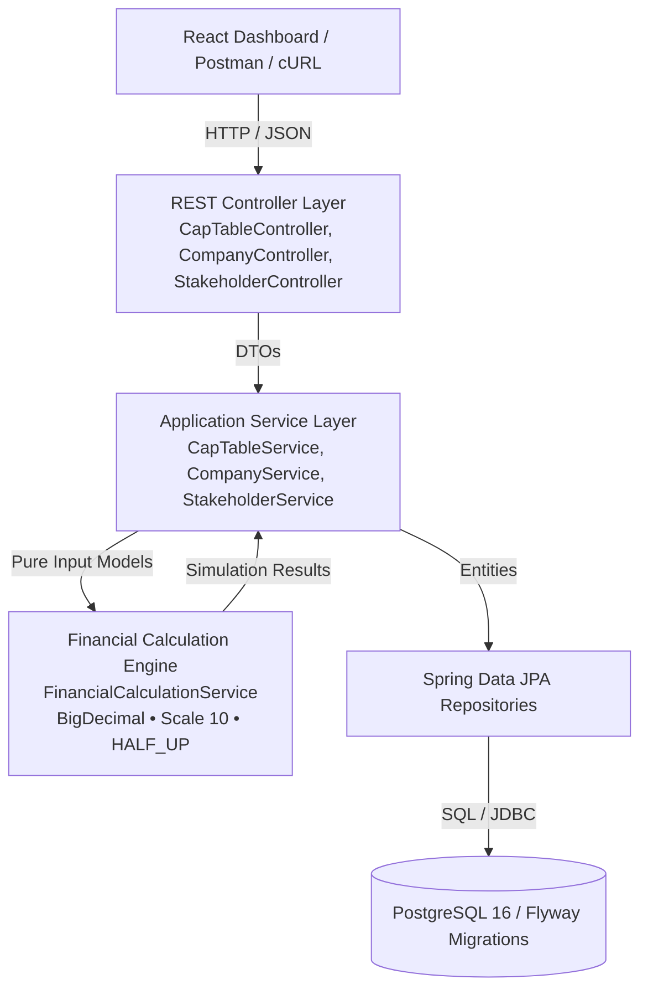
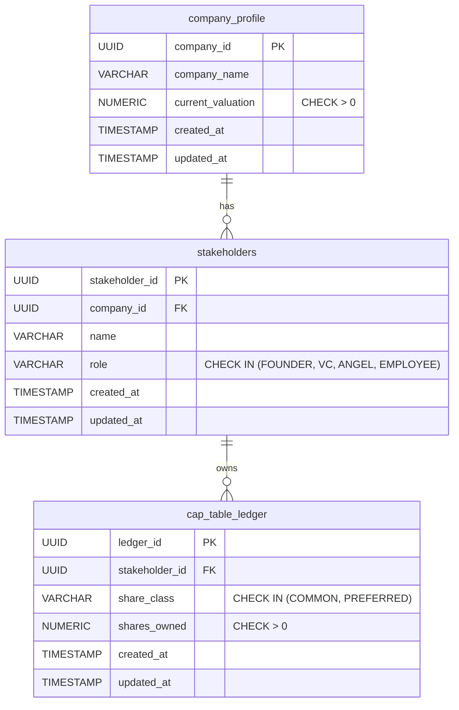

# CapTableX – Startup Cap Table & Funding Round Dilution Simulator

CapTableX is a production-grade financial engineering platform and venture capital simulator built with **Java 17**, **Spring Boot 3**, **PostgreSQL**, and **React**. It models capitalization tables, tracks common and preferred share allocations across founders, employees, and investors, and simulates equity dilution resulting from priced venture financing rounds (such as Seed, Series A, and Series B) with mathematical precision.

The core calculation engine uses `BigDecimal` arithmetic with an isolated calculation scale of 10 decimal places and standard half-up rounding, eliminating IEEE 754 floating-point inaccuracies. The simulation engine is idempotent and read-only, allowing founders and venture investors to model equity dilution scenarios without mutating persistent ledger state.

---

## Table of Contents
1. [Problem Statement](#problem-statement)
2. [Features](#features)
3. [Technology Stack](#technology-stack)
4. [Architecture](#architecture)
5. [Database Design](#database-design)
6. [Financial Calculation Model](#financial-calculation-model)
   - [Core Mathematical Formulas](#core-mathematical-formulas)
   - [Step-by-Step Worked Example (NovaFin Series A)](#step-by-step-worked-example-novafin-series-a)
7. [API Documentation](#api-documentation)
8. [Running Locally](#running-locally)
9. [Environment Variables](#environment-variables)
10. [Automated Testing](#automated-testing)
11. [Postman Collection](#postman-collection)
12. [Key Architectural & Design Decisions](#key-architectural--design-decisions)
13. [Financial Assumptions & Limitations](#financial-assumptions--limitations)
14. [Future Roadmap](#future-roadmap)

---

## Problem Statement

When early-stage startups raise priced equity financing rounds, incoming investors inject fresh capital in exchange for newly minted shares. This transaction impacts the company's capitalization structure in two fundamental ways:
1. **The denominator expands**: The total number of shares issued and outstanding increases, meaning existing shareholders own a smaller percentage of the company (equity dilution).
2. **The share count remains unchanged**: Existing shareholders do not lose actual shares; their fractional ownership decreases while the valuation of each share typically increases.

In practice, founders frequently confuse **percentage-point dilution** (the absolute drop in percentage ownership) with **relative dilution** (the proportion of existing equity relinquished). Furthermore, manual spreadsheet calculations are vulnerable to floating-point rounding errors, hardcoded formulas, and unvalidated inputs.

CapTableX provides a deterministic, automated backend engine that formalizes share issuance rules, validates relational data integrity, and delivers transparency into pre-money and post-money equity distributions.

---

## Features

- **Double-Entry Style Share Ledger**: Tracks shareholdings across distinct share classes (`COMMON`, `PREFERRED`) and stakeholder classifications (`FOUNDER`, `VC`, `ANGEL`, `EMPLOYEE`).
- **Deterministic Financial Engine**: Dedicated calculation component using `BigDecimal` arithmetic with documented precision, rounding modes, and division guards.
- **Read-Only Round Simulation**: Simulates venture rounds (`POST /api/v1/cap-table/simulate-round`) with custom pre-money valuations, new capital amounts, and investor profiles without mutating persistent data.
- **Comprehensive Dilution Analytics**: Computes post-money valuation, price per share (PPS), newly issued shares, investor ownership %, and per-stakeholder dilution (both in percentage points and relative percentage).
- **Relational Integrity & Migrations**: Automated database migrations with Flyway, check constraints enforcing positive valuations and share counts, and foreign key indexes.
- **OpenAPI 3 / Swagger Documentation**: Interactive API documentation generated dynamically via `springdoc-openapi` at `/swagger-ui.html`.
- **Interactive React Dashboard**: Lightweight visual dashboard presenting company metrics, current cap table, round simulator form, proportional stacked bars, and comparison tables.
- **Comprehensive Automated Test Suite**: 100% passing test suite encompassing unit tests for financial math edge cases (zero/negative valuations, fractional shares, precision thresholds) and integration tests for REST APIs.

---

## Technology Stack

- **Backend**:
  - **Language**: Java 17 (Eclipse Temurin LTS)
  - **Framework**: Spring Boot 3.2.3
  - **Data Access**: Spring Data JPA / Hibernate 6
  - **Validation**: Jakarta Bean Validation (`hibernate-validator`)
  - **Database Migrations**: Flyway 9+
  - **API Documentation**: Springdoc OpenAPI 2.3.0 (Swagger UI)
  - **Testing**: JUnit 5, Mockito, AssertJ, Spring MockMvc
  - **Build Tool**: Apache Maven 3.9+ with Maven Wrapper (`mvnw`)
- **Database**:
  - **Primary**: PostgreSQL 16
  - **Local/Test In-Memory Fallback**: H2 in PostgreSQL compatibility mode
- **Frontend**:
  - **Framework**: React 18
  - **Tooling**: Vite 5
  - **Icons**: Lucide React
  - **Styling**: Modern dark slate dashboard styling
- **DevOps & Tooling**:
  - Docker Compose (PostgreSQL service)
  - Postman Collection (v2.1.0 with embedded test scripts)
  - Git version control

---

## Architecture

CapTableX adheres to Clean Architecture and layered separation of concerns. Controllers strictly handle HTTP serialization and status codes, business services manage transactional boundaries and persistence, and financial calculations are isolated in an independent, pure service.



### Layer Responsibility Summary
1. **Presentation / Web Layer (`com.captablex.controller`)**: Exposes RESTful endpoints, accepts and validates DTOs with `@Valid`, and delegates immediately to service components.
2. **Application Service Layer (`com.captablex.service`)**: Manages transactions (`@Transactional`), coordinates persistence with repositories, queries cap-table ledgers, and converts entities to DTOs via `CapTableMapper`.
3. **Financial Calculation Engine (`com.captablex.calculator`)**: Pure mathematical engine with zero persistence dependencies. Accepts immutable input models, enforces calculation rules, and calculates pre/post-money valuations, PPS, share issuances, and dilution.
4. **Data Access Layer (`com.captablex.repository`)**: Spring Data JPA repositories with query methods and join fetches (`findAllByCompanyIdWithStakeholder`).
5. **Database Layer (`db/migration`)**: Flyway-managed schema migrations enforcing relational constraints at the database level.

---

## Database Design

The database schema models startups, stakeholders, and cap-table allocations with relational integrity.



### Constraints & Indexes
- **Primary Keys**: UUIDs on all tables (`UUID PRIMARY KEY`).
- **Foreign Keys**:
  - `stakeholders.company_id` -> `company_profile.company_id` (`ON DELETE CASCADE`)
  - `cap_table_ledger.stakeholder_id` -> `stakeholders.stakeholder_id` (`ON DELETE CASCADE`)
- **Check Constraints**:
  - `chk_company_valuation_positive`: `current_valuation > 0`
  - `chk_shares_owned_positive`: `shares_owned > 0`
  - `chk_stakeholder_role_valid`: `role IN ('FOUNDER', 'VC', 'ANGEL', 'EMPLOYEE')`
  - `chk_share_class_valid`: `share_class IN ('COMMON', 'PREFERRED')`
- **Indexes**:
  - `idx_stakeholders_company_id` on `stakeholders(company_id)`
  - `idx_ledger_stakeholder_id` on `cap_table_ledger(stakeholder_id)`

---

## Financial Calculation Model

### Core Mathematical Formulas

#### Step 1: Pre-Money Valuation & Capital Validation
$$\text{Pre-Money Valuation} > 0, \quad \text{Investment Amount} > 0$$

#### Step 2: Post-Money Valuation
$$\text{Post-Money Valuation} = \text{Pre-Money Valuation} + \text{Investment Amount}$$

#### Step 3: Total Pre-Money Shares
$$\text{Total Pre-Money Shares} = \sum_{i=1}^{n} \text{Existing Shares}_i$$

#### Step 4: Price Per Share (PPS)
$$\text{Price Per Share (PPS)} = \frac{\text{Pre-Money Valuation}}{\text{Total Pre-Money Shares}}$$
*Scale: 10 decimal places, `RoundingMode.HALF_UP`.*

#### Step 5: New Shares Issued
$$\text{New Shares} = \frac{\text{Investment Amount}}{\text{PPS}}$$

#### Step 6: Total Post-Money Shares
$$\text{Total Post-Money Shares} = \text{Total Pre-Money Shares} + \text{New Shares}$$

#### Step 7: New Investor Ownership %
$$\text{Investor Ownership \%} = \left( \frac{\text{New Shares}}{\text{Total Post-Money Shares}} \right) \times 100$$

#### Step 8: Existing Stakeholder Ownership %
$$\text{New Ownership \%} = \left( \frac{\text{Existing Shares}}{\text{Total Post-Money Shares}} \right) \times 100$$

#### Step 9: Dilution Metrics
1. **Percentage-Point Dilution**:
   $$\Delta_{\text{pts}} = \text{Previous Ownership \%} - \text{New Ownership \%}$$
2. **Relative Dilution %**:
   $$\Delta_{\text{rel}} = \left( \frac{\text{Previous Ownership \%} - \text{New Ownership \%}}{\text{Previous Ownership \%}} \right) \times 100 = \left( \frac{\text{New Shares}}{\text{Total Post-Money Shares}} \right) \times 100$$

---

### Step-by-Step Worked Example (NovaFin Series A)

#### Scenario Setup:
- **Company**: NovaFin Technologies
- **Pre-Money Valuation**: ₹40,000,000.00
- **Total Existing Shares**: 1,000,000 Common Shares
  - Founder A: 600,000 shares (60.0000%)
  - Founder B: 300,000 shares (30.0000%)
  - Employee ESOP Pool: 100,000 shares (10.0000%)
- **New Investment**: ₹10,000,000.00 from Alpha Ventures (VC) for Preferred Shares

#### Calculation Steps:
1. **Post-Money Valuation**:
   $$\text{Post-Money} = ₹40,000,000 + ₹10,000,000 = ₹50,000,000.00$$
2. **Price Per Share (PPS)**:
   $$\text{PPS} = \frac{₹40,000,000}{1,000,000 \text{ shares}} = ₹40.0000 \text{ per share}$$
3. **New Shares Issued**:
   $$\text{New Shares} = \frac{₹10,000,000}{₹40.0000} = 250,000 \text{ Preferred Shares}$$
4. **Total Post-Money Shares**:
   $$\text{Total Post-Money Shares} = 1,000,000 + 250,000 = 1,250,000 \text{ shares}$$
5. **New Investor Ownership % (Alpha Ventures)**:
   $$\text{Ownership \%} = \left( \frac{250,000}{1,250,000} \right) \times 100 = 20.0000\%$$
6. **Existing Shareholder Redistribution**:
   - **Founder A**:
     - Previous: $\frac{600,000}{1,000,000} \times 100 = 60.0000\%$
     - Post-Round: $\frac{600,000}{1,250,000} \times 100 = 48.0000\%$
     - Percentage-Point Dilution: $60.0000\% - 48.0000\% = 12.0000 \text{ percentage points}$
     - Relative Dilution: $\frac{12.0000\%}{60.0000\%} \times 100 = 20.0000\%$
   - **Founder B**:
     - Previous: $\frac{300,000}{1,000,000} \times 100 = 30.0000\%$
     - Post-Round: $\frac{300,000}{1,250,000} \times 100 = 24.0000\%$
     - Percentage-Point Dilution: $30.0000\% - 24.0000\% = 6.0000 \text{ percentage points}$
     - Relative Dilution: $\frac{6.0000\%}{30.0000\%} \times 100 = 20.0000\%$
   - **Employee ESOP Pool**:
     - Previous: $\frac{100,000}{1,000,000} \times 100 = 10.0000\%$
     - Post-Round: $\frac{100,000}{1,250,000} \times 100 = 8.0000\%$
     - Percentage-Point Dilution: $10.0000\% - 8.0000\% = 2.0000 \text{ percentage points}$
     - Relative Dilution: $\frac{2.0000\%}{10.0000\%} \times 100 = 20.0000\%$

#### Summary Table:
| Stakeholder | Shares Held | Before % | After % | Dilution (pts) | Relative Dilution % |
|---|---|---|---|---|---|
| **Founder A** | 600,000 | 60.0000% | 48.0000% | -12.0000% | 20.0000% |
| **Founder B** | 300,000 | 30.0000% | 24.0000% | -6.0000% | 20.0000% |
| **Employee Pool** | 100,000 | 10.0000% | 8.0000% | -2.0000% | 20.0000% |
| **Alpha Ventures (VC)** | 250,000 | 0.0000% | 20.0000% | +20.0000% | N/A |
| **Total** | **1,250,000** | **100.0000%** | **100.0000%** | **0.0000%** | – |

---

## API Documentation

Interactive Swagger UI documentation is available at:
`http://localhost:8080/swagger-ui.html`

### 1. Health Probe
- **Endpoint**: `GET /api/v1/health`
- **Response**: `200 OK`
```json
{
  "service": "CapTableX Backend",
  "status": "UP",
  "timestamp": "2026-09-15T22:30:00Z"
}
```

### 2. Get Current Cap Table
- **Endpoint**: `GET /api/v1/cap-table/{companyId}`
- **Parameters**: `companyId` (UUID, path)
- **Response**: `200 OK`
```json
{
  "companyId": "a1b2c3d4-0001-4000-8000-000000000001",
  "companyName": "NovaFin Technologies",
  "valuation": 40000000.0000,
  "totalShares": 1000000.0000,
  "stakeholders": [
    {
      "stakeholderId": "a1b2c3d4-0002-4000-8000-000000000002",
      "name": "Founder A",
      "role": "FOUNDER",
      "shareClass": "COMMON",
      "shares": 600000.0000,
      "ownershipPercentage": 60.0000
    },
    {
      "stakeholderId": "a1b2c3d4-0003-4000-8000-000000000003",
      "name": "Founder B",
      "role": "FOUNDER",
      "shareClass": "COMMON",
      "shares": 300000.0000,
      "ownershipPercentage": 30.0000
    },
    {
      "stakeholderId": "a1b2c3d4-0004-4000-8000-000000000004",
      "name": "Employee ESOP Pool",
      "role": "EMPLOYEE",
      "shareClass": "COMMON",
      "shares": 100000.0000,
      "ownershipPercentage": 10.0000
    }
  ]
}
```

### 3. Simulate Funding Round (Read-Only)
- **Endpoint**: `POST /api/v1/cap-table/simulate-round`
- **Request Body**:
```json
{
  "companyId": "a1b2c3d4-0001-4000-8000-000000000001",
  "preMoneyValuation": 40000000.00,
  "investmentAmount": 10000000.00,
  "investorName": "Alpha Ventures",
  "investorType": "VC",
  "shareClass": "PREFERRED"
}
```
- **Response**: `200 OK`
```json
{
  "companyId": "a1b2c3d4-0001-4000-8000-000000000001",
  "preMoneyValuation": 40000000.0000,
  "investmentAmount": 10000000.0000,
  "postMoneyValuation": 50000000.0000,
  "totalPreMoneyShares": 1000000.0000,
  "pricePerShare": 40.0000,
  "newSharesIssued": 250000.0000,
  "totalPostMoneyShares": 1250000.0000,
  "newInvestorName": "Alpha Ventures",
  "newInvestorType": "VC",
  "newInvestorShareClass": "PREFERRED",
  "newInvestorOwnershipPercentage": 20.0000,
  "stakeholders": [
    {
      "stakeholderId": "a1b2c3d4-0002-4000-8000-000000000002",
      "name": "Founder A",
      "role": "FOUNDER",
      "shareClass": "COMMON",
      "shares": 600000.0000,
      "previousOwnershipPercentage": 60.0000,
      "newOwnershipPercentage": 48.0000,
      "dilutionPercentagePoints": 12.0000,
      "relativeDilutionPercentage": 20.0000
    },
    {
      "stakeholderId": "a1b2c3d4-0003-4000-8000-000000000003",
      "name": "Founder B",
      "role": "FOUNDER",
      "shareClass": "COMMON",
      "shares": 300000.0000,
      "previousOwnershipPercentage": 30.0000,
      "newOwnershipPercentage": 24.0000,
      "dilutionPercentagePoints": 6.0000,
      "relativeDilutionPercentage": 20.0000
    },
    {
      "stakeholderId": "a1b2c3d4-0004-4000-8000-000000000004",
      "name": "Employee ESOP Pool",
      "role": "EMPLOYEE",
      "shareClass": "COMMON",
      "shares": 100000.0000,
      "previousOwnershipPercentage": 10.0000,
      "newOwnershipPercentage": 8.0000,
      "dilutionPercentagePoints": 2.0000,
      "relativeDilutionPercentage": 20.0000
    }
  ],
  "summary": "Alpha Ventures receives approximately 20.0000% ownership after the funding round, issuing 250000.0000 new PREFERRED shares at 40.0000 per share."
}
```

### 4. Create Company
- **Endpoint**: `POST /api/v1/companies`
- **Request Body**:
```json
{
  "companyName": "NovaFin Technologies",
  "currentValuation": 40000000.00
}
```
- **Response**: `201 Created`

### 5. Add Stakeholder
- **Endpoint**: `POST /api/v1/companies/{companyId}/stakeholders`
- **Request Body**:
```json
{
  "name": "Founder C",
  "role": "FOUNDER"
}
```
- **Response**: `201 Created`

### 6. Add Share Allocation (Ledger Entry)
- **Endpoint**: `POST /api/v1/stakeholders/{stakeholderId}/shares`
- **Request Body**:
```json
{
  "shareClass": "COMMON",
  "sharesOwned": 50000.00
}
```
- **Response**: `201 Created`

---

## Running Locally

### Prerequisites
- **Java 17+**
- **Node.js 18+** & **npm**
- **Docker** & **Docker Compose** (for PostgreSQL) *or use the built-in local profile*

### Step 1: Clone Repository
```bash
git clone https://github.com/your-repo/captablex.git
cd captablex
```

### Step 2: Configure Environment & Database
Copy `.env.example` to `.env` or set environment variables:
```bash
cp .env.example .env
```

To run with PostgreSQL using Docker Compose:
```bash
docker-compose up -d
```
*Note: If Docker is not installed, the application runs automatically using the `local` profile with in-memory H2 in PostgreSQL compatibility mode.*

### Step 3: Run Backend Migrations & Application
Using the Maven wrapper:
```bash
cd backend
./mvnw spring-boot:run
```
*(On Windows cmd/powershell: `mvnw.cmd spring-boot:run`)*

The backend will automatically execute Flyway migrations `V1__create_cap_table_schema.sql` and `V2__seed_demo_data.sql`, listening at `http://localhost:8080`.

### Step 4: Run React Frontend
In a new terminal:
```bash
cd frontend
npm install
npm run dev
```
Open `http://localhost:5173` in your browser.

---

## Environment Variables

| Variable | Description | Default |
|---|---|---|
| `SERVER_PORT` | Port for Spring Boot HTTP server | `8080` |
| `SPRING_PROFILES_ACTIVE` | Active Spring profile (`postgres`, `local`) | `local` |
| `DB_HOST` | PostgreSQL hostname | `localhost` |
| `DB_PORT` | PostgreSQL port | `5432` |
| `DB_NAME` | Database name | `captablex` |
| `DB_USERNAME` | Database username | `postgres` |
| `DB_PASSWORD` | Database password | `postgres` |
| `DB_URL` | Complete JDBC database URL | `jdbc:postgresql://localhost:5432/captablex` |

---

## Automated Testing

Execute the complete JUnit 5 and Spring Boot integration test suite:
```bash
cd backend
./mvnw test
```

### Test Coverage Highlights:
- **`FinancialCalculationServiceTest`**:
  1. Post-money valuation addition
  2. PPS calculation with high-precision division
  3. New shares calculation
  4. Existing shareholder dilution logic
  5. New investor equity percentage
  6. Uneven ownership percentage formatting
  7. Zero and negative pre-money valuation rejection
  8. Zero and negative investment capital rejection
  9. Empty cap-table execution rejection
  10. Fractional PPS rounding tolerance and 100% ownership sum invariance
  11. **NovaFin Technologies Worked Case**: Verifies exact mathematical matching of Section 23 specification.
- **`CapTableControllerIntegrationTest`**:
  - `GET /api/v1/cap-table/{companyId}`: Seeded data retrieval, 404 for non-existent company, 400 for malformed UUID.
  - `POST /api/v1/cap-table/simulate-round`: Round simulation output verification, 400 validation errors on negative numbers, 400 on blank strings.
  - Health check endpoint verification.
  - Company creation API verification.

---

## Postman Collection

Import `CapTableX.postman_collection.json` into Postman:
1. Open Postman -> Click **Import**.
2. Select `CapTableX.postman_collection.json` from the project root.
3. The collection includes collection variables (`baseUrl`, `companyId`, `stakeholderId`) and JavaScript tests that assert HTTP 200/201 and automatically store returned IDs across requests.

---

## Key Architectural & Design Decisions

### 1. Why `BigDecimal` over `double`/`float`?
IEEE 754 floating-point types (`float`, `double`) use binary representation for fractional values, leading to cumulative precision loss (e.g. `0.1 + 0.2 = 0.30000000000000004`). In equity management, compounding rounding errors lead to unallocated shares, mismatching post-money valuations, and legal disputes. `BigDecimal` allows exact decimal representation with documented scale and rounding strategies.

### 2. Why is the simulation endpoint read-only?
Simulating venture funding is an exploratory scenario-analysis process. Founders and investors model multiple valuations, investment amounts, and option pool refreshes before term sheets are executed. Mutating database state during simulation would pollute ledger history with hypothetical transactions. Persistence belongs exclusively to an executed funding round.

### 3. Why isolate the Financial Calculation Engine?
Placing calculation formulas inside controllers or standard CRUD services violates the Single Responsibility Principle and hinders automated unit testing. By isolating `FinancialCalculationService` from Spring Web and JPA dependencies, the core math is 100% deterministic, ultra-fast to test, and reusable across multiple services.

### 4. Why use DTOs instead of exposing JPA Entities?
Exposing JPA entities directly creates tight coupling between the database schema and public API contracts, causes potential Jackson infinite recursion on bidirectional relationships, and risks mass assignment vulnerabilities. DTOs enforce strict contracts, bean validation, and clean Swagger documentation.

### 5. Why do transactions matter?
When recording an executed investment round, multiple entities must be mutated simultaneously: updating company valuation, adding new stakeholders, and inserting ledger share allocations. Enforcing transactional boundaries (`@Transactional`) guarantees ACID compliance—if any step fails, the entire transaction rolls back cleanly, avoiding corrupted cap tables.

---

## Financial Assumptions & Limitations

> [!IMPORTANT]
> **Educational & Simulator Disclaimer**: CapTableX is an educational and portfolio engineering project. It does not constitute legal, accounting, tax, or investment advice. Real-world venture financing transactions require legal counsel and formal board/shareholder consents.

### Modeled Simplifications:
- **Simplified Share Classes**: While `COMMON` and `PREFERRED` classes are recorded, liquidation preferences (such as 1x non-participating vs. participating preferences) and seniority waterfalls are not modeled.
- **No Convertible Debt / SAFEs**: The simulation models priced equity rounds with explicit pre-money valuations; it does not model post-money SAFE conversions, valuation caps, or discount rates.
- **No Option Pool Shuffle**: In many Series A rounds, investors require an unallocated option pool (e.g. 10-15%) to be created *prior* to their investment, which dilutes founders disproportionately. This simulator dilutes all pre-existing stakeholders pro-rata.
- **No Anti-Dilution Provisions**: Down-round price protections (such as Full Ratchet or Broad-Based Weighted Average) are not modeled.
- **No Legal Issuance Workflow**: Does not generate stock certificates, 83(b) election forms, or cap-table vesting schedules.

---

## Future Roadmap

1. **Convertible Securities Engine**: Modeling Y Combinator standard post-money SAFEs and convertible notes with valuation caps and discounts.
2. **Option Pool Shuffle Modeling**: Modeling pre-money vs post-money unallocated option pool expansions.
3. **Liquidation Preference Waterfall Simulator**: Simulating exit valuations ($10M to $500M) across multiple preferred series (Seed, Series A, Series B) with liquidation preferences and participation caps.
4. **Historical Cap-Table Snapshots**: Audit logs and time-travel capability to inspect cap tables at any historical date.
5. **Role-Based Access Control (RBAC)**: Spring Security integration with JWT authentication for Founders, Investors, and Legal Counsel.
